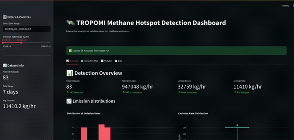

# TROPOMI Methane Hotspot Detection Pipeline

A pipeline for detecting and analyzing methane emissions using TROPOMI satellite data from Google Earth Engine. This tool helps researchers and analysts identify methane hotspots, estimate emission rates, and explore the data through an interactive dashboard.


*Interactive dashboard showing detected methane hotspots and analysis*

## Features

- **Satellite Data Access**: Works directly with TROPOMI/Sentinel-5P methane data via Google Earth Engine
- **Hotspot Detection**: Uses statistical methods and spatial clustering to find emission sources  
- **Emission Estimates**: Calculates emission rates using simplified atmospheric models
- **Interactive Dashboard**: Built-in Streamlit dashboard for exploring results
- **Time Series Analysis**: Track emission trends over time
- **Multiple Export Options**: Save results as CSV, GeoJSON, or NetCDF files
- **Visualization Tools**: Generate maps and plots of methane concentrations

## Getting Started

### What You'll Need

- Python 3.9 or newer
- A Google Earth Engine account (free)
- About 4-8 GB of RAM for processing

### Installation

1. **Clone and setup**
   ```bash
   git clone https://github.com/your-username/tropomi-methane-pipeline.git
   cd tropomi-methane-pipeline
   
   # I recommend using conda
   conda create -n tropomi-pipeline python=3.9
   conda activate tropomi-pipeline
   
   pip install -r requirements.txt
   ```

2. **Set up Google Earth Engine**
   ```bash
   earthengine authenticate
   # This will open your browser to authenticate
   ```

3. **Configure the pipeline**
   ```bash
   # Edit config/config.yaml and add your GEE project ID
   # You can find this in your Google Cloud Console
   ```

### Running the Pipeline

**Basic run:**
```bash
python src/main.py --start-date 2023-06-01 --end-date 2023-06-07 --verbose
```

**With interactive dashboard:**
```bash
python src/main.py --dashboard --start-date 2023-06-01 --end-date 2023-06-03
```

**Quick test (uses smaller region and date range):**
```bash
python src/main.py --test
```

## Dashboard


*Dashboard features and interactions*

The dashboard gives you several ways to explore the detected methane hotspots:

- **Interactive Map**: See hotspots on a map, toggle between different data views, step through time
- **Analysis Tab**: Look at data distributions and spatial patterns  
- **Time Series**: Watch how emissions change over time
- **Hotspot Details**: Browse all detected hotspots, filter and sort by different criteria

The dashboard automatically loads your pipeline results and lets you download the data in different formats.

## How It Works

The detection process has several steps:

1. **Data Download**: Gets TROPOMI methane data from Google Earth Engine for your region and dates
2. **Preprocessing**: Filters out bad data, removes clouds, calculates background concentrations
3. **Detection**: Finds pixels with unusually high methane compared to background
4. **Clustering**: Groups nearby high-methane pixels into hotspots
5. **Persistence Check**: Only keeps hotspots that appear across multiple days
6. **Emission Estimation**: Estimates emission rates using atmospheric models (simplified)

The algorithm tries to be robust - if the main detection method doesn't find anything, it falls back to more sensitive approaches. This helps deal with the fact that satellite data can be patchy due to clouds and other issues.

```
tropomi-methane-pipeline/
├── config/
│   ├── config.yaml              # Main configuration
│   └── logging_config.py        # Logging setup
├── src/
│   ├── data/
│   │   ├── downloader.py        # TROPOMI data retrieval
│   │   └── preprocessor.py      # Data quality and enhancement calculation
│   ├── detection/
│   │   ├── anomaly_detector.py  # Statistical hotspot detection
│   │   └── quantifier.py        # Emission rate estimation
│   ├── visualization/
│   │   ├── dashboard.py         # Interactive Streamlit dashboard
│   │   └── map_plotter.py       # Static visualization tools
│   └── main.py                  # Main pipeline orchestrator
├── notebooks/
│   ├── 01_data_exploration.ipynb
│   ├── 02_detection_algorithm_development.ipynb
│   └── 03_validation_analysis.ipynb
├── tests/                       # Unit tests
├── docs/                        # Documentation and images
├── data/
│   ├── outputs/                 # Pipeline results
│   └── processed/               # Intermediate data
└── README.md
```

## Configuration

You can adjust the detection settings in `config/config.yaml`. The main things you might want to tweak:

```yaml
# Your Google Earth Engine project ID
gee:
  project_id: "your-gee-project-id"
  
# Study area and time period
data:
  start_date: "2023-06-01"
  end_date: "2023-06-07"
  region_of_interest:
    type: "bbox"
    coordinates: [-103.0, 31.5, -101.5, 33.0]  # west, south, east, north

# Detection sensitivity - lower numbers = more sensitive
detection:
  anomaly_threshold: 0.8        # How many standard deviations above background
  min_enhancement: 5.0          # Minimum enhancement in ppb to consider
  spatial_window: 3             # Smoothing window size
  temporal_window: 3            # How many days a hotspot needs to persist
```

If you're not finding hotspots, try lowering `anomaly_threshold` to 0.5 or `min_enhancement` to 2.0.

## Example Results

When the pipeline works well, you might see output like this:

```
SUCCESS! Detected 86 hotspots
Total emissions: 1,247.3 kg/hr
Results saved to: data/outputs/

Top Hotspots:
ID    Location              Enhancement    Emission Rate
--    --------              -----------    -------------
1     32.45°N, -102.12°W   67.3 ppb       45.2 kg/hr
2     32.18°N, -101.89°W   52.1 ppb       38.7 kg/hr
3     31.97°N, -102.34°W   48.9 ppb       33.1 kg/hr
```

The pipeline typically detects enhancements of 5-50 ppb above background levels. Emission rate estimates should be taken with a grain of salt - they're based on simplified atmospheric models and are meant to give rough magnitudes rather than precise values.

## Common Issues

**"No hotspots detected"**
- Try lowering the detection thresholds in config.yaml
- Make sure your region actually has methane sources (try the Permian Basin: [-103.0, 31.5, -101.5, 33.0])
- Check if there's data available for your time period

**Google Earth Engine errors**
- Run `earthengine authenticate` again
- Make sure your project ID is correct in config.yaml
- Check that you have access to the TROPOMI collection

**Dashboard won't start**
- Install streamlit: `pip install streamlit plotly folium streamlit-folium`
- Make sure you've run the main pipeline first to generate data

**Memory issues**
- Try a smaller region or shorter time period
- The pipeline needs about 4-8 GB RAM for typical regions

## Contributing

If you'd like to contribute, feel free to open issues or submit pull requests. Some areas where help would be especially useful:

- Improving the detection algorithms
- Adding support for other satellite datasets  
- Better emission rate estimation methods
- More visualization options
- Testing on different regions and time periods

## License

MIT License - see LICENSE file for details.

## Acknowledgments

- ESA/Copernicus for the TROPOMI data
- Google Earth Engine team for the excellent data platform
- The atmospheric science community for methods and validation

## Citation

If this helps with your research, you can cite it as:

```bibtex
@software{tropomi_methane_pipeline,
  title={TROPOMI Methane Hotspot Detection Pipeline},
  author={Chaurasia, Vikash},
  year={2025},
  url={https://github.com/your-username/tropomi-methane-pipeline}
}
```

---
 